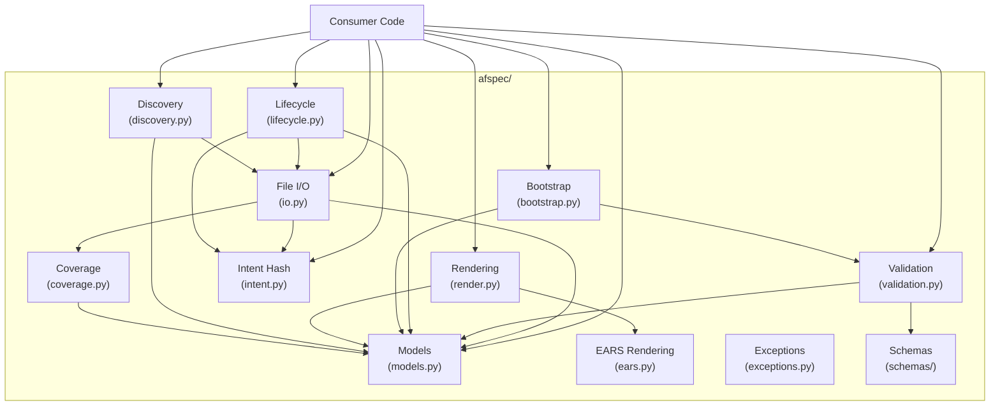

# Design Document: afspec

## Overview

`afspec` is an idiomatic Python library that models, reads, writes, validates, renders, and manages the lifecycle of agent-fox specification packages. The library is a single Python package (`afspec`) with submodules for models, I/O, validation, lifecycle, rendering, discovery, and schema embedding. All public types are Pydantic models (immutable by default via `frozen=True` where appropriate). File I/O uses atomic writes. Validation returns structured error lists. Rendering is deterministic and byte-identical to the Go implementation.

## Architecture



### Module Responsibilities

1. **models.py** — All Pydantic model definitions: `Spec`, `PRDDocument`, `PRDFrontmatter`, `Requirements`, `TestSpec`, `Tasks`, `Criterion`, `Requirement`, `UserStory`, `CorrectnessProperty`, `ExecutionPath`, `PathStep`, `ErrorHandlingEntry`, `TestCase`, `PropertyTest`, `EdgeCaseTest`, `SmokeTest`, `Coverage`, `TaskGroup`, `Subtask`, `VerificationSubtask`, `TaskDependency`, `TraceabilityEntry`, `TestCommands`, `SpecMeta`, `DependencyEdge`. Also enums: `Status`, `EARSPattern`, `SubtaskState`, `TaskGroupKind`.
2. **io.py** — `load_spec(dir)`, `save(spec, dir)` (public, with mutation guard), `_save_internal(spec, dir)` (private, bypasses mutation guard); atomic file writes; PRD parsing and serialization.
3. **validation.py** — `validate_schema(spec)`, `validate_cross_file(spec)`, `validate(spec)`; `ValidationError` model.
4. **lifecycle.py** — `transition(spec, target, dir)`, `supersede(spec, superseding_spec_id, dir)`, `move_to_archive(spec_dir, root)`; mutation guards; state machine.
5. **bootstrap.py** — `BootstrapSpec` class; `set_prd`, `set_requirements`, `set_test_spec`, `set_tasks`, `finalize`.
6. **render.py** — `render_requirements`, `render_test_spec`, `render_tasks`, `render_combined`; deterministic markdown output.
7. **ears.py** — `render_ears_sentence(criterion)` — EARS sentence rendering from criterion fields.
8. **discovery.py** — `discover_specs(root)`, `build_dependency_graph(metas, root)`; `DependencyGraph` class.
9. **intent.py** — `compute_intent_hash(body)` — normalization and SHA-256.
10. **coverage.py** — `compute_coverage(test_spec, requirements)`.
11. **exceptions.py** — `SpecError`, `LoadError`, `SaveError`, `LifecycleError`, `IntentError`, `BootstrapError`.
12. **schemas/** — Package data directory containing embedded JSON Schema files (`requirements.v1.json`, `test_spec.v1.json`, `tasks.v1.json`, `prd-frontmatter.v1.json`).
13. **mutate.py** — Collection mutation methods (`add_*`, `get_*`, `remove_*`), glossary manipulation (`set_glossary_entry`, `remove_glossary_entry`), ID generation helpers (`next_*_id`), and `Subtask.transition_to`. Since Pydantic models are immutable, mutation methods return new model instances.
14. **constructors.py** — Factory functions for EARS criterion builders (`ubiquitous_criterion`, `event_driven_criterion`, etc.) with `with_return_contract` chaining. Also `create_spec(spec_id, spec_name)` for programmatic construction.
15. **__init__.py** — Re-exports all public types, functions, and exceptions.

## Execution Paths

### Path 1: Load spec from disk

```
1. Consumer → afspec.load_spec(dir)
2. io.py: load_spec → reads prd.md bytes from dir
3. io.py: _parse_prd(text) → PRDDocument — parses YAML frontmatter + body
4. io.py: load_spec → reads requirements.json, test_spec.json, tasks.json
5. io.py: json.loads each → dict, then Pydantic model_validate for Requirements, TestSpec, Tasks
6. io.py: load_spec → assembles Spec(prd=..., requirements=..., test_spec=..., tasks=...)
7. io.py: load_spec → captures _ImmutableSnapshot(spec_id, spec_name, created_at, supersedes) from PRD frontmatter into spec._loaded
8. Returns Spec to consumer
```

### Path 2: Save spec to disk

```
1. Consumer → afspec.save(spec, dir)
2. io.py: save → mutation guard: if status is sealed/superseded/archived → raise LifecycleError
3. io.py: save → mutation guard: if status is active AND spec._loaded is not None → compare PRD frontmatter immutable fields (spec_id, spec_name, created_at, supersedes) against spec._loaded snapshot; raise LifecycleError if any differ. Also verify intent hash.
4. io.py: save → coverage.py: compute_coverage(spec.test_spec, spec.requirements) → Coverage
5. io.py: save → updates spec.test_spec with computed coverage
6. io.py: save → sets spec.prd.frontmatter.updated_at to datetime.now(UTC)
7. io.py: save → _render_prd(spec.prd) → str (YAML frontmatter + body)
8. io.py: save → json_serialize for requirements.json, test_spec.json, tasks.json
9. io.py: save → writes each to temp file, then os.rename atomically
10. Returns to consumer (or raises SaveError, cleaning up temp files)
```

### Path 3: Validate spec

```
1. Consumer → afspec.validate(spec)
2. validation.py: validate → validate_schema(spec) → list[ValidationError]
3. validation.py: validate_schema → loads schema bytes via importlib.resources
4. validation.py: validate_schema → jsonschema.validate for each artifact
5. validation.py: validate → validate_cross_file(spec) → list[ValidationError]
6. validation.py: validate_cross_file → checks artifact completeness: if any of requirements.spec_id, test_spec.spec_id, or tasks.spec_id is empty, returns a ValidationError with message containing "incomplete". Short-circuits before rule checks.
7. validation.py: validate_cross_file → checks rules 1-8 across all four artifacts
8. Returns combined list[ValidationError] to consumer
```

### Path 4: Lifecycle transition

```
1. Consumer → afspec.transition(spec, target, dir)
2. lifecycle.py: transition → rejects Status.SUPERSEDED (must use supersede)
3. lifecycle.py: transition → checks _is_legal_transition(spec.prd.frontmatter.status, target)
4. lifecycle.py: if draft→active → intent.py: compute_intent_hash(spec.prd.body) → hash
5. lifecycle.py: stores hash in spec.prd.frontmatter.intent_hash
6. lifecycle.py: sets spec.prd.frontmatter.status = target
7. lifecycle.py: io.py: _save_internal(spec, dir) → persists transition to disk
8. Returns updated Spec to consumer (or raises LifecycleError)
```

### Path 4a: Supersede spec

```
1. Consumer → afspec.supersede(spec, superseding_spec_id, dir)
2. lifecycle.py: supersede → checks spec.prd.frontmatter.status == sealed
3. lifecycle.py: prepends deprecation banner with superseding_spec_id to spec.prd.body
4. lifecycle.py: sets spec.prd.frontmatter.status = superseded
5. lifecycle.py: io.py: _save_internal(spec, dir) → persists banner and status to disk
6. Returns updated Spec to consumer (or raises LifecycleError)
```

### Path 4b: Archive spec (move to archive folder)

```
1. Consumer → afspec.move_to_archive(spec_dir, root)
2. lifecycle.py: move_to_archive → io.py: load_spec(spec_dir) → Spec
3. lifecycle.py: if status is active → raise LifecycleError (non-archivable)
4. lifecycle.py: if status is draft or sealed → transition(spec, Status.ARCHIVED, spec_dir)
5. lifecycle.py: if status is superseded or archived → no transition needed
6. lifecycle.py: os.makedirs(root/archive, exist_ok=True) → creates archive dir if needed
7. lifecycle.py: shutil.move(spec_dir, root/archive/basename) → moves folder
8. Returns to consumer (or raises LifecycleError)
```

### Path 5: Bootstrap spec creation

```
1. Consumer → BootstrapSpec(spec_id, spec_name)
2. Consumer → bs.set_prd(prd), bs.set_requirements(req), bs.set_test_spec(ts), bs.set_tasks(tasks)
3. Consumer → bs.finalize()
4. bootstrap.py: finalize → checks all four artifacts are set
5. bootstrap.py: finalize → assembles Spec from stored artifacts
6. bootstrap.py: finalize → validation.py: validate(spec) → list[ValidationError]
7. Returns Spec to consumer (or raises BootstrapError with validation errors)
```

### Path 6: Render markdown

```
1. Consumer → afspec.render_combined(spec)
2. render.py: render_combined → uses spec.prd.body as-is
3. render.py: render_combined → render_requirements(spec.requirements) → str
4. render.py: render_requirements → ears.py: render_ears_sentence(criterion) for each criterion
5. render.py: render_combined → render_test_spec(spec.test_spec) → str
6. render.py: render_combined → render_tasks(spec.tasks) → str
7. render.py: render_combined → concatenates: PRD body + "\n\n---\n\n" + requirements + test_spec + tasks
8. Returns combined markdown string to consumer
```

### Path 7: Discover specs

```
1. Consumer → afspec.discover_specs(root)
2. discovery.py: discover_specs → os.listdir(root) → entries
3. discovery.py: filters entries matching regex `^\d+_[a-z][a-z0-9_]*$`, skips "archive"
4. discovery.py: for each match → reads prd.md, parses frontmatter only → SpecMeta
5. Returns list[SpecMeta] to consumer
6. Consumer → afspec.build_dependency_graph(metas, root)
7. discovery.py: for each SpecMeta → reads tasks.json, extracts dependencies list
8. discovery.py: validates every depends_on_spec references a spec in metas → raise SpecError if not
9. discovery.py: builds directed graph, checks for cycles → raise SpecError if cycle detected
10. Returns DependencyGraph to consumer
11. Consumer → graph.dependencies(spec_id) → list[DependencyEdge]
12. Consumer → graph.dependents(spec_id) → list[DependencyEdge]
13. Consumer → graph.topological_sort() → list[str]
```

### Path 8: Programmatic spec construction

```
1. Consumer → afspec.create_spec(spec_id, spec_name) → Spec (with initialized sub-artifacts)
2. Consumer → spec.requirements.add_requirement(Requirement(...)) → Requirements
3. Consumer → req.add_criterion(event_driven_criterion(...).with_return_contract(...)) → Requirement
4. Consumer → spec.requirements.set_glossary_entry(term, definition) → Requirements
5. Consumer → spec.test_spec.add_test_case(TestCase(...)) → TestSpec
6. Consumer → spec.tasks.add_task_group(TaskGroup(...)) → Tasks
7. Consumer → group.add_subtask(Subtask(...)) → TaskGroup
8. Consumer → afspec.save(spec, dir) or bs.finalize()
```

## Components and Interfaces

### Public API

```python
# --- Core Types (models.py) ---

class Status(str, Enum):
    DRAFT = "draft"
    ACTIVE = "active"
    SEALED = "sealed"
    SUPERSEDED = "superseded"
    ARCHIVED = "archived"

class EARSPattern(str, Enum):
    UBIQUITOUS = "ubiquitous"
    EVENT_DRIVEN = "event_driven"
    COMPLEX_EVENT = "complex_event"
    STATE_DRIVEN = "state_driven"
    UNWANTED = "unwanted"
    OPTIONAL = "optional"

class SubtaskState(str, Enum):
    PENDING = "pending"
    QUEUED = "queued"
    IN_PROGRESS = "in_progress"
    DONE = "done"
    PENDING_REEVALUATION = "pending_reevaluation"
    DROPPED = "dropped"

class TaskGroupKind(str, Enum):
    TESTS = "tests"
    STANDARD = "standard"
    CHECKPOINT = "checkpoint"
    WIRING_VERIFICATION = "wiring_verification"

def valid_transition(current: SubtaskState, target: SubtaskState) -> bool: ...

class Spec(BaseModel):
    prd: PRDDocument
    requirements: Requirements
    test_spec: TestSpec
    tasks: Tasks
    _loaded: Optional[_ImmutableSnapshot] = PrivateAttr(default=None)

# --- File I/O (io.py) ---

def load_spec(dir: str | Path) -> Spec: ...
def save(spec: Spec, dir: str | Path) -> None: ...

# --- Validation (validation.py) ---

class ValidationError(BaseModel):
    file: str
    path: str
    message: str
    rule: str

def validate(spec: Spec) -> list[ValidationError]: ...
def validate_schema(spec: Spec) -> list[ValidationError]: ...
def validate_cross_file(spec: Spec) -> list[ValidationError]: ...

# --- Lifecycle (lifecycle.py) ---

def transition(spec: Spec, target: Status, dir: str | Path) -> Spec: ...
def supersede(spec: Spec, superseding_spec_id: str, dir: str | Path) -> Spec: ...
def move_to_archive(spec_dir: str | Path, root: str | Path) -> None: ...

# --- Bootstrap (bootstrap.py) ---

class BootstrapSpec:
    def __init__(self, spec_id: str, spec_name: str) -> None: ...
    def set_prd(self, prd: PRDDocument) -> None: ...
    def set_requirements(self, req: Requirements) -> None: ...
    def set_test_spec(self, ts: TestSpec) -> None: ...
    def set_tasks(self, t: Tasks) -> None: ...
    def finalize(self) -> Spec: ...

# --- Rendering (render.py) ---

def render_ears_sentence(c: Criterion) -> str: ...
def render_requirements(req: Requirements) -> str: ...
def render_test_spec(ts: TestSpec) -> str: ...
def render_tasks(t: Tasks) -> str: ...
def render_combined(spec: Spec) -> str: ...

# --- Discovery (discovery.py) ---

class DependencyGraph:
    def edges(self) -> list[DependencyEdge]: ...
    def dependencies(self, spec_id: str) -> list[DependencyEdge]: ...
    def dependents(self, spec_id: str) -> list[DependencyEdge]: ...
    def topological_sort(self) -> list[str]: ...

def discover_specs(root: str | Path) -> list[SpecMeta]: ...
def build_dependency_graph(metas: list[SpecMeta], root: str | Path) -> DependencyGraph: ...

# --- Intent Hash (intent.py) ---

def compute_intent_hash(body: str) -> str: ...

# --- Coverage (coverage.py) ---

def compute_coverage(ts: TestSpec, req: Requirements) -> Coverage: ...

# --- Constructors (constructors.py) ---

def create_spec(spec_id: str, spec_name: str) -> Spec: ...

# --- EARS Criterion Builders (constructors.py) ---

def ubiquitous_criterion(id: str, system: str, action: str) -> Criterion: ...
def event_driven_criterion(id: str, trigger: str, system: str, action: str) -> Criterion: ...
def complex_event_criterion(id: str, trigger: str, condition: str, system: str, action: str) -> Criterion: ...
def state_driven_criterion(id: str, state: str, system: str, action: str) -> Criterion: ...
def unwanted_criterion(id: str, error_condition: str, system: str, action: str) -> Criterion: ...
def optional_criterion(id: str, feature: str, system: str, action: str) -> Criterion: ...

# Criterion method:
# def with_return_contract(self, rc: str) -> Criterion: ...

# --- Mutation Methods (mutate.py) ---
# These are module-level functions that accept a model and return a new model.
# Since Pydantic models are immutable, mutations create copies.

# Requirements mutations
def add_requirement(req: Requirements, r: Requirement) -> Requirements: ...
def get_requirement(req: Requirements, id: str) -> Optional[Requirement]: ...
def remove_requirement(req: Requirements, id: str) -> tuple[Requirements, bool]: ...
def set_glossary_entry(req: Requirements, term: str, definition: str) -> Requirements: ...
def remove_glossary_entry(req: Requirements, term: str) -> tuple[Requirements, bool]: ...
def add_correctness_property(req: Requirements, p: CorrectnessProperty) -> Requirements: ...
def add_execution_path(req: Requirements, p: ExecutionPath) -> Requirements: ...
def add_error_handling(req: Requirements, e: ErrorHandlingEntry) -> Requirements: ...

# Requirement mutations
def add_criterion(req: Requirement, c: Criterion) -> Requirement: ...
def add_edge_case(req: Requirement, c: Criterion) -> Requirement: ...
def get_criterion(req: Requirement, id: str) -> Optional[Criterion]: ...

# TestSpec mutations
def add_test_case(ts: TestSpec, tc: TestCase) -> TestSpec: ...
def add_property_test(ts: TestSpec, pt: PropertyTest) -> TestSpec: ...
def add_edge_case_test(ts: TestSpec, et: EdgeCaseTest) -> TestSpec: ...
def add_smoke_test(ts: TestSpec, st: SmokeTest) -> TestSpec: ...

# Tasks mutations
def add_task_group(t: Tasks, g: TaskGroup) -> Tasks: ...
def add_dependency(t: Tasks, d: TaskDependency) -> Tasks: ...
def add_traceability_entry(t: Tasks, e: TraceabilityEntry) -> Tasks: ...
def add_subtask(g: TaskGroup, s: Subtask) -> TaskGroup: ...

# ID generation helpers
def next_requirement_id(req: Requirements) -> str: ...
def next_criterion_id(r: Requirement) -> str: ...
def next_edge_case_id(r: Requirement) -> str: ...
def next_correctness_property_id(req: Requirements) -> str: ...
def next_execution_path_id(req: Requirements) -> str: ...
def next_error_handling_id(req: Requirements) -> str: ...
def next_test_case_id(ts: TestSpec) -> str: ...
def next_property_test_id(ts: TestSpec) -> str: ...
def next_edge_case_test_id(ts: TestSpec) -> str: ...
def next_smoke_test_id(ts: TestSpec) -> str: ...
```

### PRD Types

```python
class PRDDocument(BaseModel):
    frontmatter: PRDFrontmatter
    body: str

class PRDFrontmatter(BaseModel):
    spec_id: str
    spec_name: str
    title: str
    status: Status
    created_at: str
    updated_at: str
    owner: str
    source: str
    supersedes: list[str] = []
    tags: list[str] = []
    intent_hash: Optional[str] = None
    schema_version: int = 1
```

### Requirements Types

```python
class Requirements(BaseModel):
    schema_ref: Optional[str] = Field(None, alias="$schema")
    spec_id: str
    spec_name: str
    schema_version: int = 1
    introduction: str
    glossary: dict[str, str] = {}
    requirements: list[Requirement] = []
    correctness_properties: list[CorrectnessProperty] = []
    execution_paths: list[ExecutionPath] = []
    error_handling: list[ErrorHandlingEntry] = []

class Requirement(BaseModel):
    id: str
    title: str
    user_story: UserStory
    acceptance_criteria: list[Criterion] = []
    edge_cases: list[Criterion] = []

class UserStory(BaseModel):
    role: str
    goal: str
    benefit: str

class Criterion(BaseModel):
    id: str
    ears_pattern: EARSPattern
    system: str
    action: str
    return_contract: Optional[str] = None
    trigger: Optional[str] = None
    condition: Optional[str] = None
    error_condition: Optional[str] = None
    state: Optional[str] = None
    feature: Optional[str] = None

    def with_return_contract(self, rc: str) -> "Criterion": ...

class CorrectnessProperty(BaseModel):
    id: str
    title: str
    for_any: str
    invariant: str
    validates: list[str] = []

class ExecutionPath(BaseModel):
    id: str
    title: str
    steps: list[PathStep] = []

class PathStep(BaseModel):
    actor: str
    action: str

class ErrorHandlingEntry(BaseModel):
    id: str
    condition: str
    behavior: str
    requirement_id: str
```

### TestSpec Types

```python
class TestSpec(BaseModel):
    schema_ref: Optional[str] = Field(None, alias="$schema")
    spec_id: str
    spec_name: str
    schema_version: int = 1
    test_cases: list[TestCase] = []
    property_tests: list[PropertyTest] = []
    edge_case_tests: list[EdgeCaseTest] = []
    smoke_tests: list[SmokeTest] = []
    coverage: Coverage = Coverage()

class TestCase(BaseModel):
    id: str
    requirement_id: str
    kind: str
    description: str
    preconditions: list[str] = []
    input: Any = None
    expected: Any = None
    assertion_pseudocode: str = ""

class PropertyTest(BaseModel):
    id: str
    property_id: str
    validates: list[str] = []
    description: str
    for_any_strategy: str = ""
    invariant_check: str = ""

class EdgeCaseTest(BaseModel):
    id: str
    requirement_id: str
    kind: str
    description: str
    preconditions: list[str] = []
    input: Any = None
    expected: Any = None
    assertion_pseudocode: str = ""

class SmokeTest(BaseModel):
    id: str
    execution_path_id: str
    description: str
    trigger: str = ""
    real_components: list[str] = []
    mockable: list[str] = []
    expected_effects: list[str] = []

class Coverage(BaseModel):
    requirements_covered: list[str] = []
    properties_covered: list[str] = []
    paths_covered: list[str] = []
    gaps: list[str] = []
```

### Tasks Types

```python
class Tasks(BaseModel):
    schema_ref: Optional[str] = Field(None, alias="$schema")
    spec_id: str
    spec_name: str
    schema_version: int = 1
    test_commands: TestCommands = TestCommands()
    dependencies: list[TaskDependency] = []
    task_groups: list[TaskGroup] = []
    traceability: list[TraceabilityEntry] = []

class TestCommands(BaseModel):
    spec_tests: str = ""
    all_tests: str = ""
    linter: str = ""

class TaskDependency(BaseModel):
    depends_on_spec: str
    from_group: int
    to_group: int
    relationship: str
    sentinel: bool = False

class TaskGroup(BaseModel):
    id: int
    kind: TaskGroupKind
    title: str
    subtasks: list[Subtask] = []
    verification: VerificationSubtask = VerificationSubtask()

class Subtask(BaseModel):
    id: str
    title: str
    details: list[str] = []
    test_spec_refs: list[str] = []
    requirement_refs: list[str] = []
    state: SubtaskState = SubtaskState.PENDING
    optional: bool = False

    def transition_to(self, target: SubtaskState) -> "Subtask": ...

class VerificationSubtask(BaseModel):
    id: str = ""
    checks: list[str] = []

class TraceabilityEntry(BaseModel):
    requirement_id: str
    test_spec_id: str
    task_id: str
    test_path: Optional[str] = None
```

## Data Models

### PRD Frontmatter Field Order (YAML serialization)

Fields are serialized in this fixed order, matching the Pydantic model declaration and `docs/spec-format.md` §4.1:

```
spec_id, spec_name, title, status, created_at, updated_at, owner, source, supersedes, tags, intent_hash, schema_version
```

### JSON Serialization

- 2-space indentation via custom serializer
- Trailing newline appended after final `}`
- Model fields serialized in declaration order (Pydantic preserves this)
- Dict keys sorted alphabetically via custom serializer
- `None` for nullable fields serialized as JSON `null` (or omitted with `exclude_none` for pattern-specific criterion fields)
- `Any` for free-form objects (`input`, `expected` in test cases)
- Optional pattern-specific criterion fields (`trigger`, `condition`, `error_condition`, `state`, `feature`) are excluded from JSON when `None` (matching Go's `omitempty`)

### Subtask State Transitions

```
pending      → queued, dropped
queued       → in_progress, pending, dropped
in_progress  → done, pending_reevaluation
done         → pending_reevaluation
pending_reevaluation → pending, dropped
dropped      → (terminal)
```

### Lifecycle State Transitions

```
transition(spec, target, dir):
  draft → active (+ saves)
  draft → archived (+ saves)
  active → sealed (+ saves)
  sealed → archived (+ saves)

supersede(spec, superseding_spec_id, dir):
  sealed → superseded (+ banner + saves)

move_to_archive(spec_dir, root):
  draft → archived (+ transition + saves + folder move)
  sealed → archived (+ transition + saves + folder move)
  superseded → (no transition, folder move only)
  archived → (no transition, folder move only)
  active → error (non-archivable)

Terminal states:
  superseded → (terminal)
  archived → (terminal)
```

### EARS Rendering Templates

| Pattern | Template |
|---------|----------|
| ubiquitous | `THE {system} SHALL {action}` |
| event_driven | `WHEN {trigger}, THE {system} SHALL {action}` |
| complex_event | `WHEN {trigger} AND {condition}, THE {system} SHALL {action}` |
| state_driven | `WHILE {state}, THE {system} SHALL {action}` |
| unwanted | `IF {error_condition}, THEN THE {system} SHALL {action}` |
| optional | `WHERE {feature}, THE {system} SHALL {action}` |

When `return_contract` is non-null, append: ` AND return {return_contract}`.

### Tasks Markdown Rendering Format

Rendered from `tasks.json` data:

```markdown
# Implementation Plan: {spec_name}

## Test Commands

- Spec tests: `{test_commands.spec_tests}`
- All tests: `{test_commands.all_tests}`
- Linter: `{test_commands.linter}`

## Dependencies

| Depends On | From Group | To Group | Relationship |
|------------|-----------|----------|--------------|
| {dep.depends_on_spec} | {dep.from_group} | {dep.to_group} | {dep.relationship} |

## Tasks

- {checkbox} {group.id}. {group.title}
  - {checkbox} {subtask.id} {subtask.title}
    - {detail}
    - _Test Spec: {comma-separated test_spec_refs}_
    - _Requirements: {comma-separated requirement_refs}_

  - {checkbox} {group.id}.V Verify task group {group.id}
    - {check}

## Traceability

| Requirement | Test Spec Entry | Task | Test Path |
|-------------|-----------------|------|-----------|
| {entry.requirement_id} | {entry.test_spec_id} | {entry.task_id} | {entry.test_path or "null"} |
```

Checkbox state mapping:

| SubtaskState | Checkbox |
|-------------|----------|
| pending | `[ ]` |
| queued | `[~]` |
| in_progress | `[-]` |
| done | `[x]` |
| pending_reevaluation | `[?]` |
| dropped | _(omitted from output)_ |

Optional subtasks append `*` after the checkbox: `[ ]*`.

### Deprecation Banner Format

When a spec transitions to `superseded`:

```markdown
> **SUPERSEDED** by spec {superseding_spec_id}. This spec is retained for historical reference only.
```

The `superseding_spec_id` is provided as a parameter to the `supersede` function. The banner is prepended to the PRD body, separated by a blank line from existing content.

## Operational Readiness

- **Observability**: Validation errors are structured (`ValidationError` with file, path, message, rule fields) for programmatic consumption.
- **Rollout**: Semver releases via PyPI. Breaking changes use major version bump.
- **Migration**: Schema version field (`schema_version: 1`) enables future schema evolution.
- **Compatibility**: Golden fixtures ensure cross-implementation byte-identical output with the Go library.

## Correctness Properties

### Property 1: Round-trip idempotency

*For any* valid `Spec` value, loading then saving then loading SHALL produce an identical in-memory state, excluding the `updated_at` field (which is reset on each save) and the `coverage` field (which is recomputed on each save).

**Validates: Requirements 01-REQ-2.1, 01-REQ-3.1, 01-REQ-3.2**

### Property 2: EARS pattern field correctness

*For any* `Criterion` value that passes schema validation, the set of non-None pattern-specific fields SHALL be exactly the set required by its declared `ears_pattern`, and no other pattern-specific fields SHALL be non-None.

**Validates: Requirements 01-REQ-1.2, 01-REQ-4.3**

### Property 3: Subtask state machine legality

*For any* pair of `SubtaskState` values `(current, target)`, `valid_transition(current, target)` SHALL return `True` if and only if the transition is in the legal transition set defined in `docs/spec-format.md` §7.3.1.

**Validates: Requirements 01-REQ-1.3**

### Property 4: Schema validation soundness

*For any* `Spec` that passes `validate_schema`, all required fields SHALL be present, all ID format patterns SHALL match, all enum values SHALL be valid, and no unknown fields SHALL be present.

**Validates: Requirements 01-REQ-4.1, 01-REQ-4.E1, 01-REQ-4.E2**

### Property 5: Cross-file reference integrity

*For any* `Spec` that passes `validate_cross_file`, every `requirement_id` referenced in `TestSpec`, `Tasks` traceability, and `ErrorHandling` SHALL exist in `Requirements`.

**Validates: Requirements 01-REQ-5.2, 01-REQ-5.4**

### Property 6: Lifecycle transition legality

*For any* `Status` value `current` and `Status` value `target`, `transition(spec, target, dir)` SHALL succeed if and only if the (current, target) pair is in the set {(draft, active), (active, sealed), (sealed, archived), (draft, archived)} and the save to `dir` succeeds. `transition` SHALL reject `Status.SUPERSEDED` (must use `supersede`). `supersede(spec, id, dir)` SHALL succeed if and only if the current status is `sealed` and the save to `dir` succeeds.

**Validates: Requirements 01-REQ-6.1, 01-REQ-6.E1, 01-REQ-6.6, 01-REQ-6.E3**

### Property 7: Atomic save consistency

*For any* save operation that fails after writing at least one temporary file, no temporary files SHALL remain on disk after the error is raised.

**Validates: Requirements 01-REQ-3.3, 01-REQ-3.E2**

### Property 8: Deterministic rendering

*For any* `Spec` value, calling the same render function twice with the same input SHALL produce byte-identical output.

**Validates: Requirements 01-REQ-8.6**

### Property 9: Intent hash stability

*For any* PRD body string, `compute_intent_hash` SHALL produce the same digest regardless of original line endings (CR, LF, CRLF), leading/trailing whitespace, or letter casing.

**Validates: Requirements 01-REQ-10.1**

### Property 10: Coverage computation correctness

*For any* `TestSpec` and `Requirements` values, `compute_coverage` SHALL produce a `Coverage` where `requirements_covered` contains exactly the set of acceptance criterion and edge case IDs that have a corresponding test case or edge case test, `properties_covered` contains exactly the set of correctness property IDs that have a property test, `paths_covered` contains exactly the set of execution path IDs that have a smoke test, and `gaps` contains exactly the IDs that lack coverage.

**Validates: Requirements 01-REQ-3.5**

### Property 11: Constructor completeness

*For any* factory function call with valid required fields, the returned value SHALL have the corresponding fields populated with the provided values, all pattern-specific fields set correctly (for EARS criterion builders), and all other fields at their default values.

**Validates: Requirements 01-REQ-1.5, 01-REQ-1.6**

### Property 12: Collection mutation idempotency

*For any* sequence of `add_*` calls with unique IDs followed by a `get_*` call for each added ID, `get_*` SHALL return the exact value that was added. For any ID not added, `get_*` SHALL return `None`.

**Validates: Requirements 01-REQ-11.1, 01-REQ-11.2**

## Error Handling

| Error Condition | Behavior | Requirement |
|----------------|----------|-------------|
| Spec directory missing | Raise `LoadError` | 01-REQ-2.E1 |
| Artifact file missing | Raise `LoadError` listing missing files | 01-REQ-2.E1 |
| Malformed JSON in artifact | Raise `LoadError` with file name | 01-REQ-2.E2 |
| Invalid/missing YAML frontmatter | Raise `LoadError` | 01-REQ-2.E3 |
| Target directory does not exist | Raise `SaveError` | 01-REQ-3.E1 |
| Partial write failure | Clean up temp files, raise `SaveError` | 01-REQ-3.E2 |
| Unknown fields in JSON | Report as `ValidationError` | 01-REQ-4.E1 |
| Invalid `ears_pattern` value | Report as schema error | 01-REQ-4.E2 |
| Incomplete spec for cross-file validation | Return `ValidationError` with "incomplete" | 01-REQ-5.E1 |
| Illegal lifecycle transition | Raise `LifecycleError` with states | 01-REQ-6.E1 |
| Transition called with SUPERSEDED | Raise `LifecycleError` directing to use supersede | 01-REQ-6.E1 |
| Supersede called on non-sealed spec | Raise `LifecycleError` naming current state | 01-REQ-6.E3 |
| MoveToArchive on non-existent directory | Raise `LifecycleError` | 01-REQ-6.E4 |
| MoveToArchive on active state (non-archivable) | Raise `LifecycleError` naming current state | 01-REQ-6.E4 |
| MoveToArchive on already-archived folder | Raise `LifecycleError` | 01-REQ-6.E5 |
| Intent modified in active state | Raise `LifecycleError` | 01-REQ-6.E2 |
| `finalize` with missing artifacts | Raise `BootstrapError` listing missing artifacts | 01-REQ-7.E1 |
| Missing `## Intent` section | Raise `IntentError` | 01-REQ-10.E1 |
| Root directory does not exist | Raise `SpecError` | 01-REQ-9.E1 |
| Dependency cycle detected | Raise `SpecError` identifying cycle | 01-REQ-9.E3 |
| Dangling dependency reference | Raise `SpecError` identifying unknown spec ID | 01-REQ-9.E4 |
| Add with duplicate ID | Raise `ValueError` identifying the duplicate | 01-REQ-11.E1 |
| AddTraceabilityEntry with duplicate pair | Raise `ValueError` identifying duplicate pair | 01-REQ-11.E4 |
| Traceability duplicate pair in validation | Report as `ValidationError` | 01-REQ-5.7 |
| `supersedes` modified in active state | Raise `LifecycleError` from mutation guard | 01-REQ-6.4 |
| Illegal subtask transition via transition_to | Raise `LifecycleError` naming states | 01-REQ-1.7 |

## Technology Stack

- **Language**: Python 3.10+
- **Package**: `afspec`
- **Data Models**: Pydantic v2 (`pydantic>=2.0`)
- **YAML**: PyYAML (`PyYAML>=6.0`) for PRD frontmatter parsing/serialization
- **JSON Schema**: `jsonschema>=4.0` for schema validation
- **JSON**: Standard library `json` for serialization/deserialization
- **SHA-256**: Standard library `hashlib`
- **File I/O**: Standard library `os`, `pathlib`, `tempfile`, `shutil`
- **Testing**: `pytest`, `hypothesis` for property-based tests
- **Linting**: `ruff` for linting, `mypy` for type checking
- **Build**: `uv` for dependency management, `Makefile` for quality gates
- **Schema embedding**: `importlib.resources` for loading bundled JSON Schema files

## Definition of Done

A task group is complete when ALL of the following are true:

1. All subtasks within the group are checked off (`[x]`)
2. All spec tests (`test_spec.md` entries) for the task group pass
3. All property tests for the task group pass
4. All previously passing tests still pass (no regressions)
5. No linter warnings or errors introduced
6. Code is committed on a feature branch and merged into `develop`
7. Feature branch is merged back to `develop`
8. `tasks.md` checkboxes are updated to reflect completion

## Testing Strategy

- **Unit tests**: One test function per acceptance criterion and edge case. Test individual functions in isolation. Located in `tests/` directory.
- **Property-based tests**: One property test per correctness property using `hypothesis`. Generate random valid inputs and verify invariants hold.
- **Integration tests**: Smoke tests that exercise full paths from `load_spec` through validation/rendering. Use golden fixture files in `tests/golden/`.
- **Golden fixture tests**: Load golden fixtures, process (round-trip, render), compare output byte-for-byte. Located in `tests/golden/`.
- **Regression tests**: The full test suite runs on every commit via `make check`.
