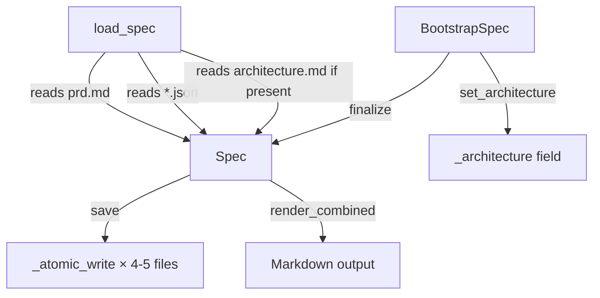

# Design Document: Architecture Support

## Overview

Add an optional `architecture` field to the `Spec` model and update the I/O,
rendering, and bootstrap modules to handle `architecture.md`. Validation
requires no changes — it already operates only on the four known artifacts.

## Architecture



### Module Responsibilities

1. **models.py** — Defines `Spec` with optional `architecture: str | None` field.
2. **io.py** — Reads `architecture.md` in `load_spec`; writes it in `save` and `_save_internal` when non-None.
3. **render.py** — Inserts architecture content in `render_combined` between PRD body and requirements.
4. **bootstrap.py** — Provides `set_architecture` method; passes content through in `finalize`.
5. **validation.py** — No changes (already scoped to four artifacts).
6. **lifecycle.py** — No changes (`_save_internal` changes are in io.py; directory moves handle all files).

## Execution Paths

### Path 1: Load spec with architecture.md present

1. `io.py: load_spec(dir)` — entry point
2. `io.py: load_spec` — checks required files exist (prd.md, requirements.json, test_spec.json, tasks.json)
3. `io.py: load_spec` — reads and parses all four required artifacts
4. `io.py: load_spec` — checks if `architecture.md` exists in dir
5. `io.py: load_spec` — reads `architecture.md` as UTF-8 string
6. `io.py: load_spec` — assembles `Spec(prd=..., requirements=..., test_spec=..., tasks=..., architecture=content)` → `Spec`
7. Caller receives `Spec` with `architecture` populated

### Path 2: Save spec with architecture content

1. `io.py: save(spec, dir)` — entry point (spec.architecture is not None)
2. `io.py: save` — performs mutation guards and lifecycle checks
3. `io.py: save` — computes coverage, updates timestamps
4. `io.py: save` — serializes and writes four required artifacts via `_atomic_write`
5. `io.py: save` — writes `architecture.md` via `_atomic_write(dir / "architecture.md", spec.architecture)`
6. Save completes successfully

### Path 3: Combined rendering with architecture

1. `render.py: render_combined(spec)` — entry point (spec.architecture is not None)
2. `render.py: render_combined` — appends PRD body (stripped)
3. `render.py: render_combined` — appends horizontal rule separator
4. `render.py: render_combined` — appends architecture content (stripped)
5. `render.py: render_combined` — appends horizontal rule separator
6. `render.py: render_combined` — appends rendered requirements, test_spec, tasks
7. Returns combined markdown string → `str`

### Path 4: Bootstrap with architecture

1. `bootstrap.py: BootstrapSpec.__init__(spec_id, spec_name)` — creates bootstrap handle
2. `bootstrap.py: BootstrapSpec.set_architecture(content)` — stores architecture content
3. `bootstrap.py: BootstrapSpec.set_prd(prd)` — sets PRD artifact
4. `bootstrap.py: BootstrapSpec.set_requirements(req)` — sets requirements artifact
5. `bootstrap.py: BootstrapSpec.set_test_spec(ts)` — sets test spec artifact
6. `bootstrap.py: BootstrapSpec.set_tasks(tasks)` — sets tasks artifact
7. `bootstrap.py: BootstrapSpec.finalize()` — assembles `Spec` with architecture, runs validation → `tuple[Spec | None, list[ValidationError]]`

## Components and Interfaces

### Model Change (models.py)

```python
class Spec(BaseModel):
    prd: PRDDocument = Field(default_factory=PRDDocument)
    requirements: Requirements = Field(default_factory=Requirements)
    test_spec: TestSpec = Field(default_factory=TestSpec)
    tasks: Tasks = Field(default_factory=Tasks)
    architecture: str | None = None  # NEW
    _loaded: Optional[_ImmutableSnapshot] = PrivateAttr(default=None)
```

### I/O Changes (io.py)

```python
# In load_spec, after loading four artifacts:
arch_path = dir_path / "architecture.md"
architecture = arch_path.read_text(encoding="utf-8") if arch_path.is_file() else None

# In save and _save_internal, after writing four artifacts:
if spec.architecture is not None:
    _atomic_write(dir_path / "architecture.md", spec.architecture)
```

### Rendering Change (render.py)

```python
# In render_combined, between PRD body and requirements:
if spec.architecture is not None:
    parts.append(spec.architecture.rstrip())
    parts.append("")
    parts.append("---")
    parts.append("")
```

### Bootstrap Change (bootstrap.py)

```python
def set_architecture(self, content: str) -> None:
    self._architecture = content

# In finalize, when assembling Spec:
spec = Spec(..., architecture=self._architecture)
```

## Data Models

No new data types. The `architecture` field is a plain `str | None`.

## Operational Readiness

No operational concerns — this is a library change with no runtime services.

## Correctness Properties

### Property 1: Architecture Round-Trip Preservation

*For any* `Spec` with `architecture` set to a non-None string value,
saving the spec to a directory and loading it back SHALL produce a `Spec`
with identical `architecture` content.

**Validates: Requirements 02-REQ-2.1, 02-REQ-3.1**

### Property 2: None Architecture Preserves Absence

*For any* `Spec` with `architecture` set to `None`, saving the spec to a
directory (that has no pre-existing `architecture.md`) and loading it back
SHALL produce a `Spec` with `architecture` equal to `None`.

**Validates: Requirements 02-REQ-2.2, 02-REQ-3.2**

### Property 3: Validation Neutrality

*For any* valid `Spec` (one that passes validation with `architecture = None`),
setting `architecture` to any non-None string value SHALL NOT change the set
of validation errors returned by `validate()`.

**Validates: Requirements 02-REQ-4.1, 02-REQ-4.2, 02-REQ-4.E1**

### Property 4: Combined Render Ordering

*For any* `Spec` with `architecture` set to a non-None string value, the output
of `render_combined` SHALL contain the architecture content after the PRD body
section and before the requirements section.

**Validates: Requirements 02-REQ-5.1**

## Error Handling

| Error Condition | Behavior | Requirement |
|----------------|----------|-------------|
| architecture.md read fails during load | LoadError raised (same as other read failures) | 02-REQ-2.1 |
| architecture.md write fails during save | SaveError raised, temp files cleaned up | 02-REQ-3.1 |
| architecture.md absent during load | architecture set to None, no error | 02-REQ-2.2 |

## Technology Stack

- Python 3.10+
- Pydantic v2 (model definition)
- Standard library pathlib (file I/O)

## Definition of Done

A task group is complete when ALL of the following are true:

1. All subtasks within the group are checked off (`[x]`)
2. All spec tests (`test_spec.md` entries) for the task group pass
3. All property tests for the task group pass
4. All previously passing tests still pass (no regressions)
5. No linter warnings or errors introduced
6. Code is committed on a feature branch and merged into `develop`
7. Feature branch is merged back to `develop`
8. `tasks.md` checkboxes are updated to reflect completion

## Testing Strategy

- **Unit tests** verify each changed function in isolation (model construction,
  load with/without architecture.md, save with/without architecture, render
  with/without architecture, bootstrap with/without architecture).
- **Property-based tests** (Hypothesis) verify round-trip preservation and
  validation neutrality across generated string inputs.
- **Integration smoke tests** verify end-to-end paths (load → modify → save →
  reload, bootstrap → finalize → save → reload, load → render_combined).
